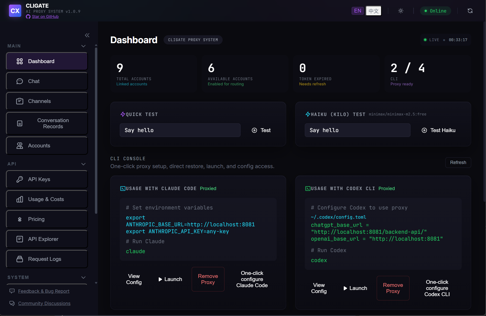
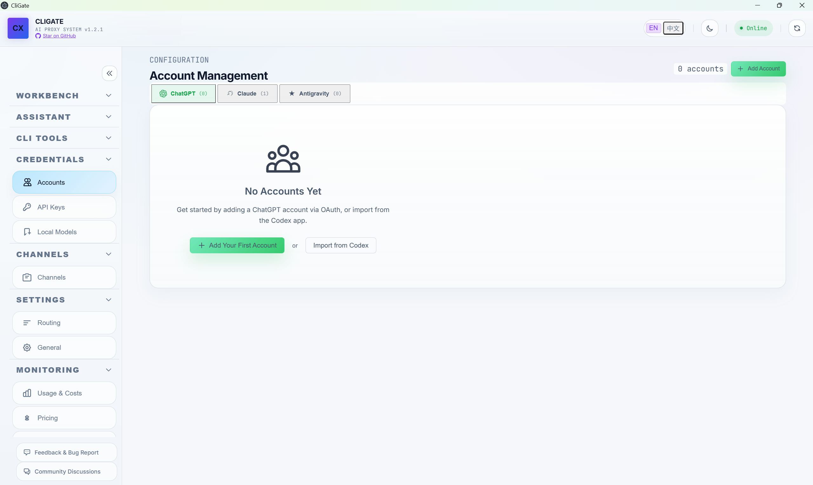
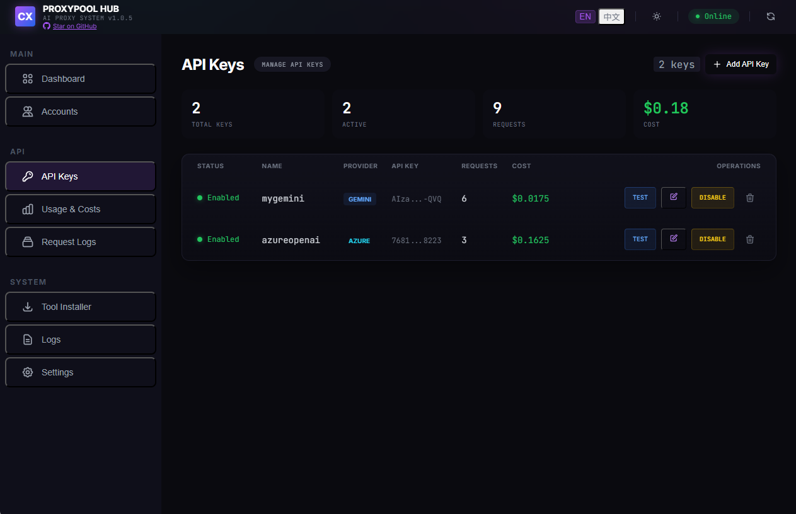
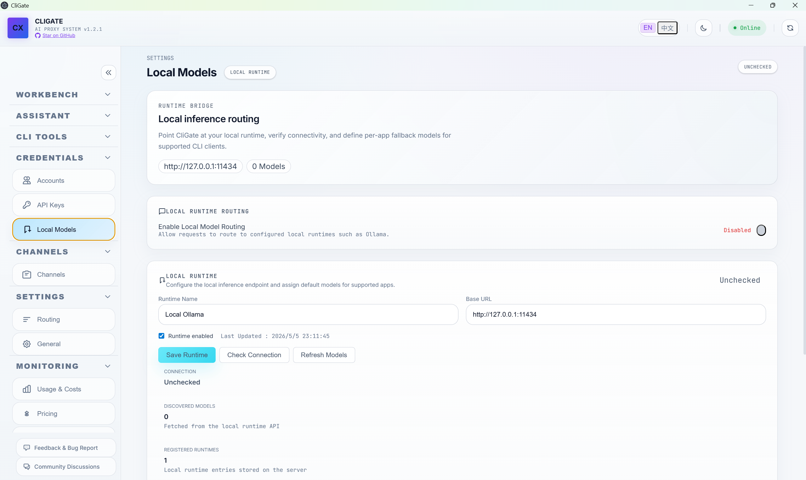
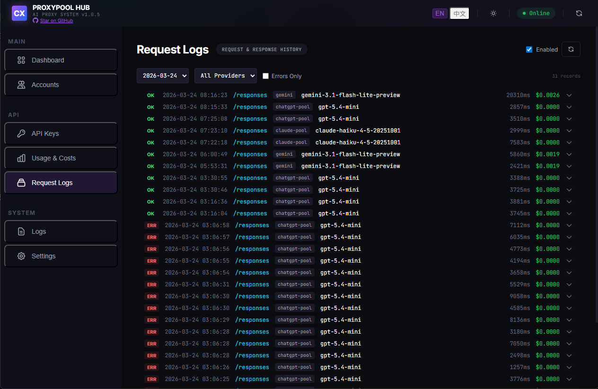
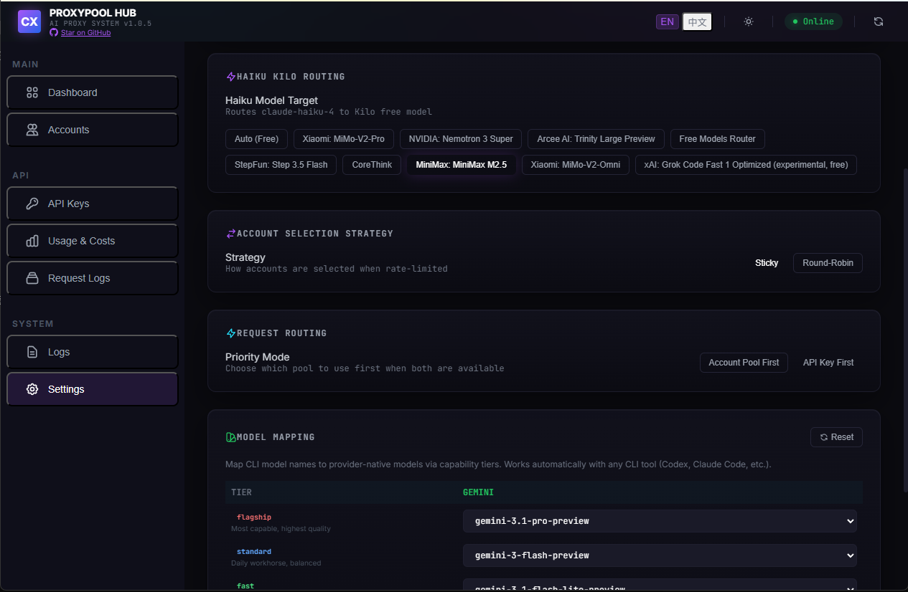
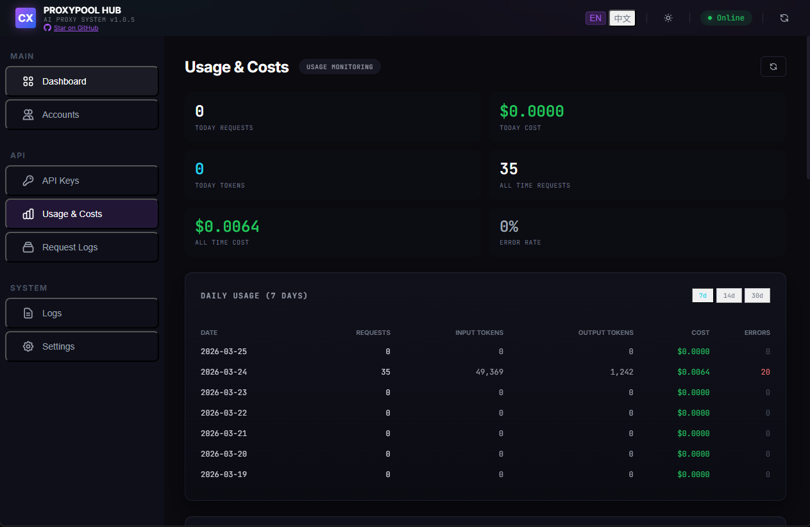
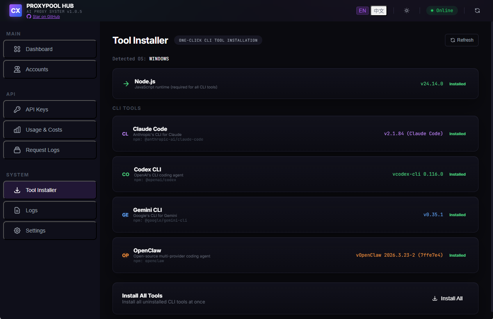

# CliGate



[](https://www.gnu.org/licenses/agpl-3.0)
[](https://nodejs.org/)
[](https://www.npmjs.com/package/cligate)
[](https://github.com/codeking-ai/cligate)

**[English](#features) | [中文](./README_CN.md)**

> A multi-protocol AI API proxy server with account pooling, API key management, and a visual dashboard.
> Use **Claude Code**, **Codex CLI**, **Gemini CLI**, and **OpenClaw** through a unified local proxy — with multi-account rotation, intelligent routing, local runtime integration, channel gateways, usage analytics, and one-click configuration.

---

## Features

### Multi-CLI Proxy Support
- **Claude Code** — Proxies Anthropic Messages API (`/v1/messages`) with streaming
- **Codex CLI** — Proxies OpenAI Responses API (`/v1/responses`), Chat Completions (`/v1/chat/completions`), and Codex Internal API (`/backend-api/codex/responses`)
- **Gemini CLI** — Proxies Gemini API (`/v1beta/models/*`) with one-click patch
- **OpenClaw** — Custom provider injection via `anthropic-messages` or `openai-completions`
- **Agent Runtime Providers** — Built-in runtime orchestration for Codex and Claude Code sessions through the dashboard and channel gateways

### Account & Key Management
- **ChatGPT Account Pool** — OAuth login, multi-account rotation (sticky / round-robin / random), auto token refresh, per-account quota tracking
- **Claude Account Pool** — OAuth PKCE login, token refresh with source writeback to Claude Code credentials
- **Antigravity Account Pool** — Google OAuth login for enterprise models, automatic model discovery and project management
- **API Key Pool** — Support for OpenAI, Azure OpenAI, Anthropic, Google Gemini, Vertex AI, MiniMax, Moonshot, ZhipuAI keys with automatic failover and load balancing
- **Key Validation** — One-click connectivity test for each API key
- **Smart Token Refresh** — Only refreshes when tokens are about to expire (< 5 min), syncs back to source CLI tools

### Intelligent Routing
- **Priority Mode** — Choose between Account Pool First or API Key First when both are available
- **Routing Mode** — Automatic routing or manual per-app credential assignments
- **App Routing** — Bind each app (Claude Code, Codex, Gemini CLI, OpenClaw) to a specific ChatGPT account, Claude account, Antigravity account, API key, or local model runtime
- **Model Mapping** — Customize which upstream model each provider resolves to
- **Free Model Routing** — Routes `claude-haiku` requests to free models (DeepSeek, Qwen, MiniMax, etc.) via Kilo AI — no API key needed
- **Local Model Routing** — Route supported requests to locally configured runtimes such as Ollama when you want an on-device path

### Channels & Runtime Operations
- **Channel Gateway** — Connect Telegram and Feishu to CliGate so mobile conversations can enter the same orchestration layer as the web chat
- **Conversation Records** — Inspect channel-linked runtime session records, message transcripts, pairing state, and execution progress from the dashboard
- **Sticky Runtime Sessions** — Continue the same runtime session across follow-up messages in web chat or channel conversations until explicitly reset
- **Approval-aware Execution** — Surface runtime questions and approval requirements in the dashboard workflow instead of hiding them in logs

### Analytics & Monitoring
- **Usage & Costs** — Per-account, per-model, per-provider usage and cost statistics with daily/monthly breakdown
- **Request Logs** — Full request/response logging with date and provider filtering, error-only view
- **Real-time Log Stream** — Live SSE log stream for debugging
- **Pricing Registry** — View and customize per-provider, per-model pricing with manual overrides
- **API Explorer** — Send live requests to local CliGate endpoints and inspect formatted request/response payloads in one place

### Web Dashboard
- **Dashboard** — Quick status metrics (total/available accounts, expired tokens, default plan), quick test buttons, Claude Code usage example
- **Chat UI** — Interactive chat interface with source selector, runtime provider selection, system prompt, session history, and direct testing for routed models
- **Account Management** — Tabbed interface for ChatGPT, Claude, and Antigravity accounts with add/remove/enable/disable/switch
- **Channels** — Configure Telegram / Feishu providers, default runtimes, pairing requirements, and working directories
- **Conversation Records** — Review channel threads and message transcripts without reading raw JSONL logs
- **API Key Management** — Add, test, edit, disable API keys with provider-specific fields (Azure deployment name/API version, Vertex project ID/location)
- **Local Models** — Register local runtimes, check health, refresh discovered models, and enable local model routing
- **API Explorer** — Built-in panel for live endpoint testing and debugging
- **Request Logs** — Dedicated dashboard tab for request and response history
- **Tool Installer** — Detect and install/update Node.js, Claude Code, Codex CLI, Gemini CLI, OpenClaw — auto-detects OS, shows version status, checks for updates
- **Resources Catalog** — Curated directory of free and trial LLM API resources with provider details, limits, and compatibility info
- **One-click CLI Configuration** — Configure Claude Code, Codex CLI, Gemini CLI, OpenClaw with a single button
- **i18n** — English and Chinese interface
- **Dark/Light Theme** — Toggle between dark and light mode

---

## Screenshots

<table>
  <tr>
    <td align="center"><strong>Dashboard</strong></td>
    <td align="center"><strong>Chat UI</strong></td>
  </tr>
  <tr>
    <td align="center"></td>
    <td align="center"></td>
  </tr>
  <tr>
    <td align="center"><strong>Account Management</strong></td>
    <td align="center"><strong>API Key Management</strong></td>
  </tr>
  <tr>
    <td align="center"></td>
    <td align="center"></td>
  </tr>
  <tr>
    <td align="center"><strong>Channels</strong></td>
    <td align="center"><strong>Local Models</strong></td>
  </tr>
  <tr>
    <td align="center"></td>
    <td align="center"></td>
  </tr>
  <tr>
    <td align="center"><strong>Request Logs</strong></td>
    <td align="center"><strong>Settings &amp; App Routing</strong></td>
  </tr>
  <tr>
    <td align="center"></td>
    <td align="center"></td>
  </tr>
  <tr>
    <td align="center"><strong>Usage &amp; Costs</strong></td>
    <td align="center"><strong>Pricing Registry</strong></td>
  </tr>
  <tr>
    <td align="center"></td>
    <td align="center"></td>
  </tr>
  <tr>
    <td align="center"><strong>Tool Installer</strong></td>
    <td align="center"><strong>Resources Catalog</strong></td>
  </tr>
  <tr>
    <td align="center"></td>
    <td align="center"></td>
  </tr>
</table>

### Demo


---

## Architecture

```
┌─────────────┐  ┌───────────┐  ┌────────────┐  ┌──────────┐
│ Claude Code │  │ Codex CLI │  │ Gemini CLI │  │ OpenClaw │
└──────┬──────┘  └─────┬─────┘  └──────┬─────┘  └────┬─────┘
       │               │               │              │
       └───────────────┼───────────────┼──────────────┘
                       ▼
            ┌─────────────────────┐
            │   CliGate     │
            │   localhost:8081    │
            │                     │
            │  ┌───────────────┐  │
            │  │ Protocol      │  │
            │  │ Translation   │  │
            │  └───────┬───────┘  │
            │          │          │
            │  ┌───────▼───────┐  │
            │  │ Account Pool  │  │
            │  │ & Key Router  │  │
            │  └───────┬───────┘  │
            └──────────┼──────────┘
                       │
       ┌───────┬───────┼───────┬───────┐
       ▼       ▼       ▼       ▼       ▼
┌────────┐┌────────┐┌────────┐┌────────┐┌────────┐
│Anthropic││ OpenAI ││Google  ││Vertex  ││Kilo AI │
│  API   ││  API   ││Gemini  ││  AI    ││ (Free) │
└────────┘└────────┘└────────┘└────────┘└────────┘
```

---

## Quick Start

### Option 1: npx (No install)

```bash
npx cligate@latest start
```

### Option 2: Global install

```bash
npm install -g cligate
cligate start
```

### Option 3: Desktop App (Electron)

Download the latest release from [Releases](https://github.com/codeking-ai/cligate/releases).

---

## Setup

### 1. Start the server

```bash
cligate start
```

Dashboard opens at **http://localhost:8081**

### 2. Add accounts or API keys

**Web Dashboard** (recommended):
1. Open http://localhost:8081 → **Accounts** tab
2. Click **Add Account** → Login with ChatGPT / Claude / Google (Antigravity)
3. Or go to **API Keys** tab → **Add API Key** with your OpenAI, Azure, Gemini, Vertex AI, or other provider keys
4. Optionally configure **Channels** (Telegram / Feishu) or **Local Models** for local runtime routing
5. Accounts are automatically saved and tokens are auto-refreshed

**CLI**:
```bash
cligate accounts add            # Opens browser
cligate accounts add --no-browser  # Headless/VM
```

### 3. Configure your CLI tool

Click the **one-click configure** button in the Dashboard or Settings tab, or manually:

**Claude Code:**
```bash
export ANTHROPIC_BASE_URL=http://localhost:8081
export ANTHROPIC_API_KEY=any-key
claude
```

**Codex CLI:**
```toml
# ~/.codex/config.toml
chatgpt_base_url = "http://localhost:8081/backend-api/"
openai_base_url = "http://localhost:8081"
```

**Gemini CLI:** Use the one-click patch button in the dashboard.

**OpenClaw:** Use the one-click configure button, or add manually to `~/.openclaw/openclaw.json`:
```json
{
  "models": {
    "providers": {
      "cligate": {
        "baseUrl": "http://localhost:8081",
        "apiKey": "sk-ant-proxy",
        "api": "anthropic-messages"
      }
    }
  }
}
```

### 4. Configure routing (optional)

In the **Settings** tab:
- **Priority Mode** — Choose "Account Pool First" or "API Key First"
- **Routing Mode** — "Automatic" for smart routing, or "App Assigned" to bind each app to a specific credential
- **App Assignments** — Bind Claude Code, Codex, Gemini CLI, or OpenClaw to a specific account, Antigravity account, API key, or local runtime

### 5. Configure channels or local runtimes (optional)

- **Channels** tab — Configure Telegram / Feishu provider settings, default runtime provider, working directory, and pairing requirements
- **Conversation Records** tab — Inspect mobile session threads and runtime transcripts
- **Local Models** tab — Register a local runtime endpoint, check availability, and import discovered models into routing

---

## Model Mapping

| Requested Model | Routed To | Auth Required |
|:---|:---|:---:|
| `claude-sonnet-4-6` | GPT-5.2 Codex / Anthropic API | Yes |
| `claude-opus-4-6` | GPT-5.3 Codex / Anthropic API | Yes |
| `claude-haiku-4-5` | Free model via Kilo AI | No |

The haiku model can be changed to any free model (DeepSeek R1, Qwen3, MiniMax, etc.) from the Settings tab.

---

## API Endpoints

| Endpoint | Protocol | Used By |
|:---|:---|:---|
| `POST /v1/messages` | Anthropic Messages | Claude Code, OpenClaw |
| `POST /v1/chat/completions` | OpenAI Chat Completions | Codex CLI, OpenClaw |
| `POST /v1/responses` | OpenAI Responses | Codex CLI |
| `POST /backend-api/codex/responses` | Codex Internal | Codex CLI |
| `POST /v1beta/models/*` | Gemini API | Gemini CLI |
| `GET /v1/models` | OpenAI Models | All |
| `GET /api/agent-runtimes/providers` | Runtime Registry | Dashboard, channels |
| `GET /api/agent-runtimes/sessions` | Runtime Sessions | Dashboard |
| `GET /api/agent-channels/providers` | Channel Status | Dashboard |
| `GET /api/agent-channels/session-records` | Channel Runtime Session Records | Dashboard |
| `GET /api/agent-channels/conversations` | Channel Conversations | Dashboard |
| `GET /api/local-runtimes` | Local Runtime Status | Dashboard |
| `GET /api/resources` | Resource Catalog | Dashboard |
| `GET /api/tools/status` | Tool Installer Status | Dashboard |
| `GET /health` | Health Check | Monitoring |

See [API Documentation](./docs/API.md) for the full reference.

---

## Security & Privacy

- **100% Local** — Runs entirely on `localhost`, no external server involved
- **Direct Connection** — Connects directly to official APIs (OpenAI, Anthropic, Google), no third-party relay
- **No Telemetry** — Zero data collection, zero tracking
- **Token Safety** — Credentials stored locally with `0600` permissions, smart refresh avoids unnecessary token rotation
- **Source Writeback** — When tokens are refreshed for imported accounts, they are synced back to the source CLI tool so it keeps working

---

## Community

- [GitHub Discussions](https://github.com/codeking-ai/cligate/discussions) — Ask questions, share ideas, report issues
- [Discord](https://discord.gg/GgxZSehxqG) — Real-time chat with the community
- **WeChat** — Scan to add the author, note "CliGate" to join the group

  

---

## Support

If this project helps you, consider supporting its development:

[](https://afdian.com/a/yiyaoai)

---

## License

This project is licensed under [AGPL-3.0](https://www.gnu.org/licenses/agpl-3.0).

## Disclaimer

This project is an independent open-source tool. It is not affiliated with, endorsed by, or sponsored by Anthropic, OpenAI, or Google. All trademarks belong to their respective owners. Use responsibly and in accordance with applicable Terms of Service.

---

<div align="center">
  <sub>Built for developers who use multiple AI coding assistants.</sub>
  <br>
  <a href="https://github.com/codeking-ai/cligate">
    
  </a>
</div>
